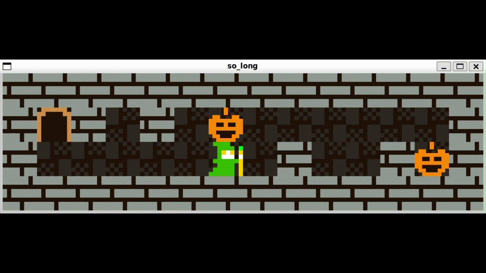

# so_long

**Küçük Bir 2D Oyun — MiniLibX ile**

Bu proje, **42 okulu** için yapılmış bir oyun projesidir.  
ᕦ(ò_óˇ)ᕤ Amaç: Minilibx ile pencere oluşturma, render süreçlerini ve sprite'ları anlamak, Klavye sinyallerini ele almak maskelemek vs. (Sinyal yönetimini öğrenmek), FloodFill gibi backtrack algoritmalarının mantığını kavramak.


---

## 📋 İçindekiler

1. [Proje Hakkında](#-proje-hakkında)  
2. [Özellikler](#-özellikler)  
3. [Gereksinimler](#-gereksinimler)  
4. [Kurulum ve Çalıştırma](#-kurulum-ve-çalıştırma)  
5. [Oynanış](#-oynanış)  
6. [Harita Formatı](#-harita-formatı)  
7. [Yapılandırma ve Komutlar](#-yapılandırma-ve-komutlar)   
8. [Lisans](#-lisans)  

---

## 🎮 Proje Hakkında

Bu oyun, `so_long` adı verilen 2D bir oyundur. MiniLibX grafik kütüphanesi kullanılarak yazılmıştır.  
Oyunun temel amacı: harita üzerindeki tüm toplanabilir öğeleri (collectibles) almak ve çıkış kapısına ulaşmak.

---

## ✨ Özellikler

- Basit ve anlaşılır grafikler ("tile-based" harita)  
- Oyuncu hareketi: `W`, `A`, `S`, `D` ile  
- Harita doğrulama: harita geçerli mi, duvarlarla çevrili mi kontrolü  
- Koleksiyon: en az bir toplanabilir öğe (C)  
- Çıkış (E), oyuncu başlangıç noktası (P) ve duvarlar (1)  
- Oyunda temel hata yönetimi (geçersiz harita, eksik elemanlar vs.)

---

## 🔌 Gereksinimler

Projeyi derlemek ve çalıştırmak için aşağıdaki gereksinimlere ihtiyacınız var:

### Sistem Gereksinimleri
- **İşletim Sistemi**: Linux veya macOS
- **Derleyici**: `gcc` veya `clang`
- **Make**: GNU Make

### Derleme Araçları
```bash
# GCC kurulumu (eğer yoksa)
# Ubuntu/Debian
sudo apt-get install gcc make
```

---

## 🔧 Kurulum ve Çalıştırma

1. Depoyu klonlayın:  
   ```bash
   git clone https://github.com/Sayicon/so_long.git
   cd so_long
   ```

2. Derleyin:
   ```bash
   make
   ```

3. Oyunu çalıştırın:
   ```bash
   ./so_long path/to/your_map.ber
   ```

   **Örnek:**
   ```bash
   ./so_long maps/map1.ber
   ```

---

## 🕹️ Oynanış

### Kontroller
- `W` → Yukarı
- `S` → Aşağı
- `A` → Sol
- `D` → Sağ
- `ESC` → Oyundan çıkış

### Oyun Kuralları
1. Tuğlaları ("tile") gezerek haritadaki `C` harflerini (collectibles) topla.
2. Tüm `C`'leri topladıktan sonra `E` (exit) noktasına git ve oyunu kazan.
3. `ESC` tuşuna basarak ya da pencerenin kapatma tuşuna tıklayarak çıkış yapabilirsin.
4. Her hamle sayaç terminalda gösterilir.

---

## 📐 Harita Formatı

### Dosya Uzantısı
- Harita uzantısı `.ber` olmalı.

### Harita Karakterleri
| Karakter | Açıklama |
|----------|----------|
| `1` | Duvar (wall) |
| `0` | Boş alan |
| `C` | Toplanabilir öğe (collectible) |
| `E` | Çıkış (exit) |
| `P` | Oyuncu başlangıç konumu (player) |

### Harita Kuralları
- Düzgün dikdörtgen olmalı
- En az bir `C` olmalı
- Sadece bir `P` ve bir `E` olmalı
- Harita kenarları tamamen `1` (duvar) ile çevrili olmalı
- Harita geçerli bir yol içermeli (FloodFill algoritması ile kontrol edilir)

### Örnek Harita
```
11111
1P0C1
10001
1C0E1
11111
```

---

## 🔨 Yapılandırma ve Makefile Kuralları

Makefile içerisinde aşağıdaki kurallar bulunur:

| Kural | Açıklama |
|-------|----------|
| `make` | Programı derler |
| `make clean` | Derleme sırasında oluşturulan `.o` dosyalarını siler |
| `make fclean` | `clean` + derlenmiş çalıştırılabilir dosyaları siler |
| `make re` | `fclean` + yeniden derleme yapar |

---

## 📄 Lisans

Bu proje MIT Lisansı ile lisanslanmıştır — istediğin gibi kullanabilir, değiştirebilir ve paylaşabilirsin.

---

## 🙏 Teşekkürler

42 okulu ve tüm katkıda bulunanlara teşekkürler!

**Keyifli oyunlar! 🎮✨**
